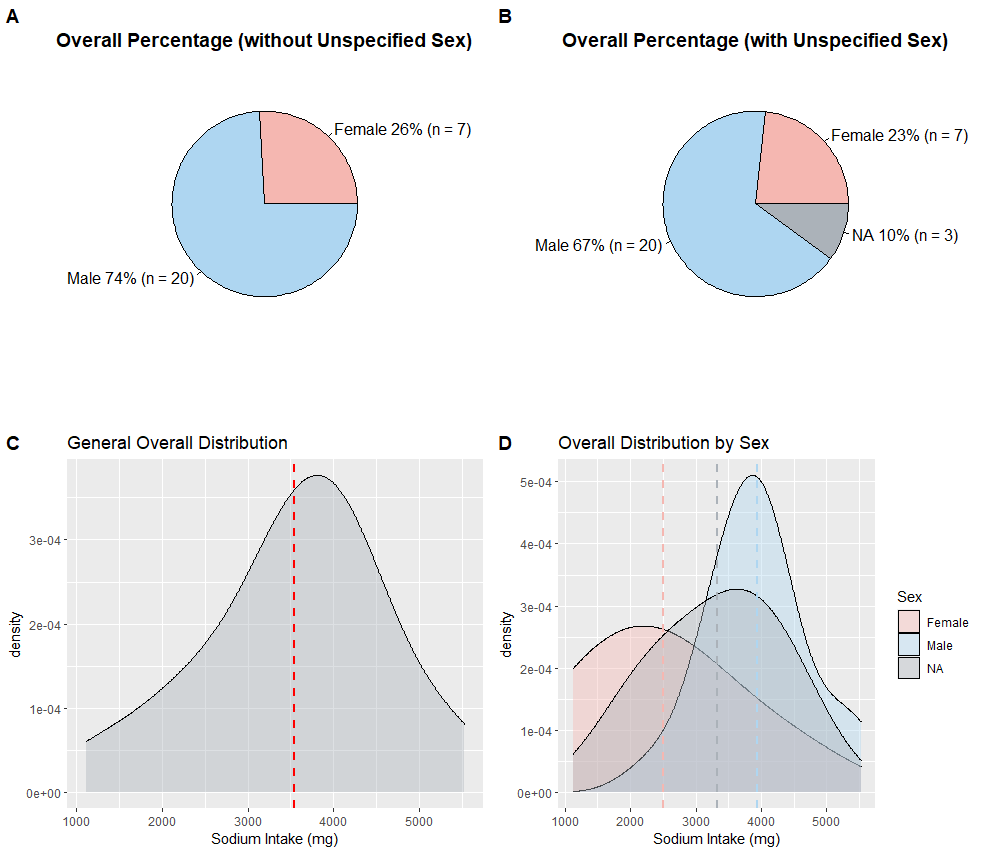

<!-- README.md is generated from README.Rmd. Please edit that file -->

```{r, include = FALSE}
knitr::opts_chunk$set(
  collapse = TRUE,
  comment = "#>",
  fig.path = "man/figures/README-",
  out.width = "100%"
)
```

# sexDisaggregate
To Obtain and Analyze Sex-disaggregated Datasets
<!-- badges: start -->
<!-- https://www.codefactor.io/repository/github/lifangy6/sexDisaggregate/issues -->
[](https://www.codefactor.io/repository/github/lifangy6/sexDisaggregate) 
[](https://github.com/lifangy6/sexDisaggregate/issues)  [](./LICENSE) 
 

<!-- https://shields.io/category/license -->
<!-- badges: end -->


## Description
`sexDisaggregate` is an R package that separates CSV datasets by sex, performs comparison visualization and helps users to examine their datasets from a sex-disaggregated perspective.


## Installation

To install the latest version of the package:

``` r
require("devtools")
devtools::install_github("lifangy6/sexDisaggregate", build_vignettes = TRUE)
library("sexDisaggregate")
```

To run the shinyApp:
``` r
sexDisaggregate::runSexDisaggregate()
```


## Overview
To have a glance of the package:
``` r
ls("package:sexDisaggregate")
data(package = "sexDisaggregate")
browseVignettes("sexDisaggregate")
```

`sexDisaggregate` contains 2 functions:

Function `separateCSV` separates provided CSV file into 3 new versions: cleaned both-sex dataframe, female-only dataframe and male-only dataframe.

Function `visualizeDiff` visualize 4 graphs that show sex percentage and specific category vs. sex in the dataset.

<div style="text-align:center">


## Contributions

The author of the package is Fangyi Li. 

* Package `ggplot2` is used to create plots in function `visualizeDiff`. 

* Package `cowplot` is used to comnine plots in function `visualizeDiff`.

* Package `shiny` is used to develop shinyApp of the package.


## References
* Chang W, Cheng J, Allaire J, Sievert C, Schloerke B, Xie Y, Allen J, McPherson J, ipert A, Borges B (2022). shiny: Web Application Framework for R. R package version 1.7.3, https://CRAN.R-project.org/package=shiny.

* Claus O. Wilke (2017). cowplot: Streamlined Plot Theme and Plot Annotations 
for 'ggplot2'. https://github.com/wilkelab/cowplot.

* Heinemann, A., Martinez, V. M., &amp; Alas, C. R. (n.d.). Why we need more 
sex-disaggregated Social Protection Data and what we're doing to get there. 
World Bank Blogs. Retrieved November 14, 2022, from https://blogs.worldbank.org/opendata/why-we-need-more-sex-disaggregated-social-protection-data-and-what-were-doing-get-there 

* R Core Team (2022). R: A language and environment for statistical computing. 
R Foundation for Statistical Computing, Vienna, Austria. https://www.R-project.org/.

* Wickham, H. and Bryan, J. (2019). R Packages (2nd edition). Newton, Massachusetts: O’Reilly Media. https://r-pkgs.org/

* Wickham H (2016). ggplot2: Elegant Graphics for Data Analysis. 
Springer-Verlag New York. ISBN 978-3-319-24277-4, https://ggplot2.tidyverse.org.
  
* Silva, Anjali. “Anjalisilva/TestingPackage: A Simple R Package Illustrating Components of an R Package: 2019-2022 BCB410H - Applied Bioinformatics, University of Toronto, Canada.” GitHub, https://github.com/anjalisilva/TestingPackage.

## Acknowledgements

This package was developed as part of an assessment for 2022 BCB410H: Applied Bioinformatics course at the University of Toronto, Toronto, CANADA. `sexDisaggregate` welcomes issues, enhancement requests, and other contributions. To submit an issue, use the [GitHub issues](https://github.com/lifangy6/sexDisaggregate/issues). Many thanks to those who provided feedback to improve this package.


## Tree Structure
``` r
- sexDisaggregate
  |- sexDisaggregate.Rproj
  |- DESCRIPTION
  |- NAMESPACE
  |- LICENSE
  |- README
  |- inst
    CITATION
    |- extdata
      |- example_data.csv
      |- example_barplot.png
      |- example_densityplot.png
      |- Overview.jpg
    |- shiny-scripts
      |- app.R
  |- man
    |- separateCSV.Rd
    |- visualizeDiff.Rd
    |- runSexDisaggregate.Rd
  |- R
    |- separateCSV.R
    |- visualizeDiff.R
    |- runSexDisaggregate.R
  |- vignettes
    |- Introduction_sexDisaggregate.Rmd
    |- example_barplot.png
    |- example_densityplot.png
    |- shiny_example.png
  |- tests
    |- testthat.R
    |- testthat
      |- test-separateCSV.R
      |- test-visualizeDiff.R
```

## Quick Tutorial

**Step 1. Separate example dataset**
``` r
exampleDataPath <- system.file("extdata", "example_data.csv", package = "sexDisaggregate")
dataList <- sexDisaggregate::separateCSV(filepath = exampleDataPath, sexTag = "Sex", femaleTag = "F", maleTag = "M")
dataList
```

**Step 2.1: Bar plot approach**
``` r
plots1 <- visualizeDiff(dataList = dataList, yTag = "Asthma", visMethod = "Bar")
plots1
```
<div style="text-align:center">

**Step 2.2: Density plot approach**
``` r
plots2 <- visualizeDiff(dataList = dataList, yTag = "Sodium Intake (mg)", visMethod = "Density")
plots2
```
<div style="text-align:center">


