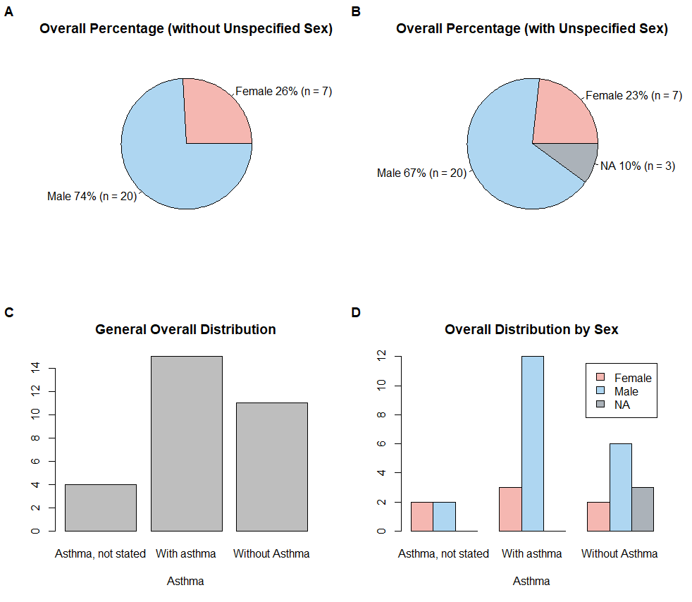
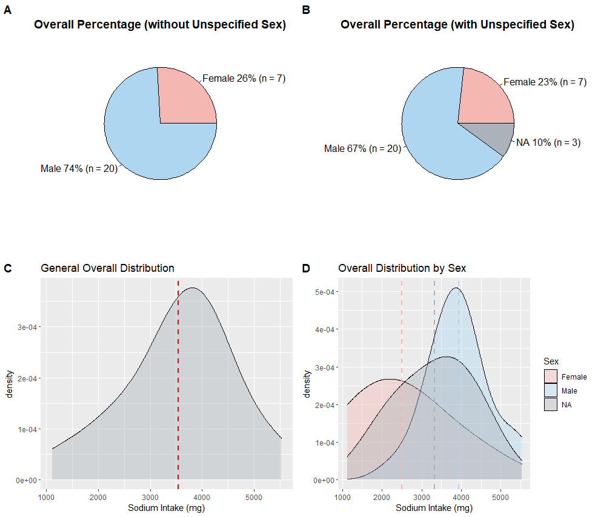
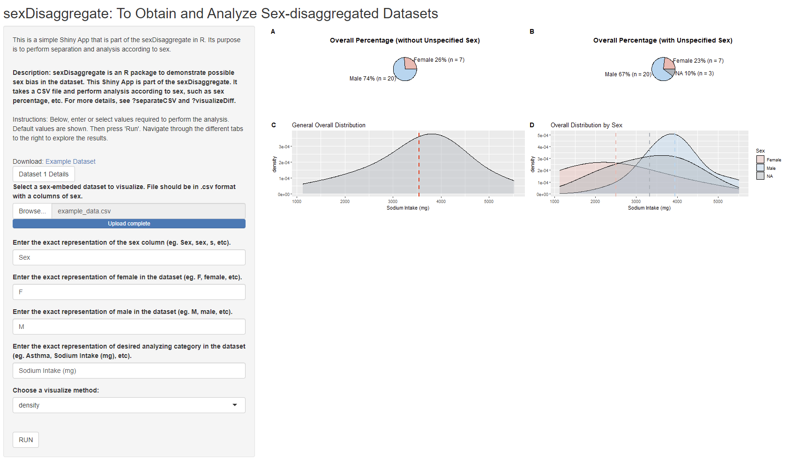

```{r, include = FALSE}
knitr::opts_chunk$set(
  collapse = TRUE,
  comment = "#>"
)
```

```{r setup}
library(sexDisaggregate)
```
```{r, include=FALSE}
library(knitr)
opts_chunk$set(fig.align = "center", 
               out.width = "90%",
               fig.width = 6, fig.height = 5.5,
               dev.args=list(pointsize=10),
               par = TRUE, # needed for setting hook 
               collapse = TRUE, # collapse input & ouput code in chunks
               warning = FALSE)
knit_hooks$set(par = function(before, options, envir)
  { if(before && options$fig.show != "none") 
       par(family = "sans", mar=c(4.1,4.1,1.1,1.1), mgp=c(3,1,0), tcl=-0.5)
})
set.seed(1) # for exact reproducibility
```

## Introduction
**sexDisaggregate** is a simple R package for separating CSV datasets by sex and performing analysis with respect to different sex groups. Function __*separateCSV*__ separates provided CSV file into 3 new datasets: a cleaned dataframe, a female-only dataframe and a male-only dataframe. Function __*visualizeDiff*__ visualizes 4 graphs that show sex percentage and sex vs. specific category in the dataset.

**This document gives a tour of sexDisaggregate functionalities**. It was written in R Markdown, using the [knitr](https://cran.r-project.org/package=knitr) package for production. 

See `help(package = "sexDisaggregate")` for further details and references provided by `citation("sexDisaggregate")`. 

To download **sexDisaggregate**, use the following commands:
``` r
require("devtools")
devtools::install_github("lifangy6/sexDisaggregate", build_vignettes = TRUE)
library("sexDisaggregate")
```

To list all functions available in the package:
``` r
lsf.str("package:sexDisaggregate")
```

To list all sample data available in the package:
``` r
data(package = "sexDisaggregate")
```

<br>

## Quick Tutorial
Use provided example CSV data to do a quick tutorial about the functions in package.

### Step 1. Separate example dataset
To use the example CSV data:
``` r
exampleDataPath <- system.file("extdata", "example_data.csv", package = "sexDisaggregate")
```

To separate the example CSV data:
``` r
dataList <- sexDisaggregate::separateCSV(filepath = exampleDataPath, sexTag = "Sex", femaleTag = "F", maleTag = "M")
dataList
```

To obtain three dataframes:
``` r
dataList$bothSex        # cleaned dataframe with both sexes and NA
dataList$femaleOnly     # cleaned dataframe with female only
dataList$maleOnly       # cleaned dataframe with male only
```

### Step 2.1: Bar plot approach
To visualize Asthma vs. Sex: 
``` r
plots1 <- sexDisaggregate::visualizeDiff(dataList = dataList, yTag = "Asthma", visMethod = "bar")
plots1
```
<div style="text-align:center">

### Step 2.2: Density plot approach
To visualize Sodium Intake vs. Sex:
``` r
plots2 <- sexDisaggregate::visualizeDiff(dataList = dataList, yTag = "Sodium Intake (mg)", visMethod = "density")
plots2
```
<div style="text-align:center">

<br>

## Shiny App
To run the shinyApp:
``` r
sexDisaggregate::runSexDisaggregate()
```
<div style="text-align:center">

<br>

## Package References
Li, F. (2022) sexDisaggregate:To Obtain and Analyze Sex-disaggregated Datasets, Unpublished. URL https://github.com/lifangy6/sexDisaggregate

<br>

## Other References
* Chang W, Cheng J, Allaire J, Sievert C, Schloerke B, Xie Y, Allen J, McPherson J, ipert A, Borges B (2022). shiny: Web Application Framework for R. R package version 1.7.3, https://CRAN.R-project.org/package=shiny.

* Claus O. Wilke (2017). cowplot: Streamlined Plot Theme and Plot Annotations 
for 'ggplot2'. https://github.com/wilkelab/cowplot.

* Heinemann, A., Martinez, V. M., &amp; Alas, C. R. (n.d.). Why we need more 
sex-disaggregated Social Protection Data and what we're doing to get there. 
World Bank Blogs. Retrieved November 14, 2022, from https://blogs.worldbank.org/opendata/why-we-need-more-sex-disaggregated-social-protection-data-and-what-were-doing-get-there 

* R Core Team (2022). R: A language and environment for statistical computing. 
R Foundation for Statistical Computing, Vienna, Austria. https://www.R-project.org/.

* Wickham, H. and Bryan, J. (2019). R Packages (2nd edition). Newton, Massachusetts: O’Reilly Media. https://r-pkgs.org/

* Wickham H (2016). ggplot2: Elegant Graphics for Data Analysis. 
Springer-Verlag New York. ISBN 978-3-319-24277-4, https://ggplot2.tidyverse.org.
  
* Silva, Anjali. “Anjalisilva/TestingPackage: A Simple R Package Illustrating Components of an R Package: 2019-2022 BCB410H - Applied Bioinformatics, University of Toronto, Canada.” GitHub, https://github.com/anjalisilva/TestingPackage.

<br>

```{r}
sessionInfo()
```
